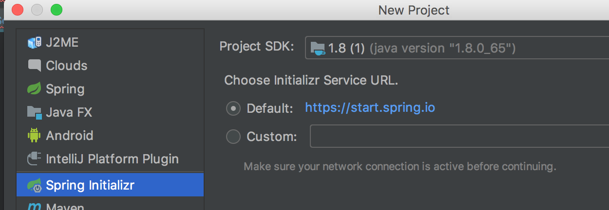
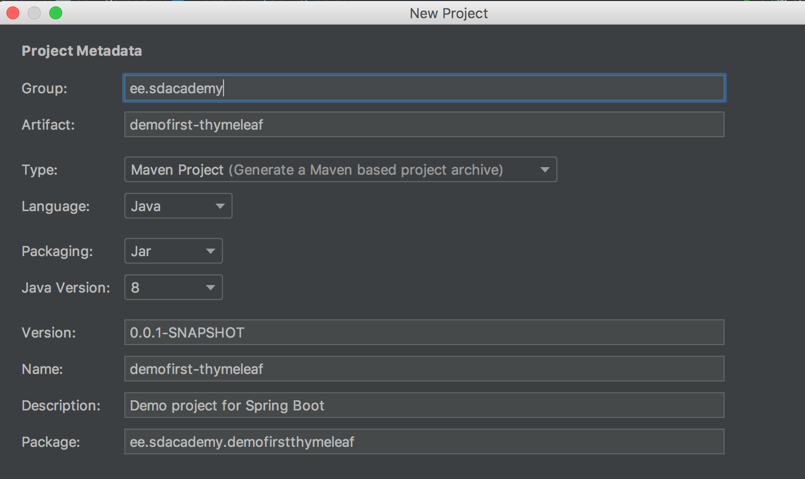
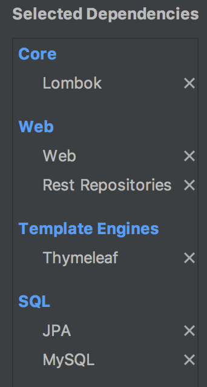
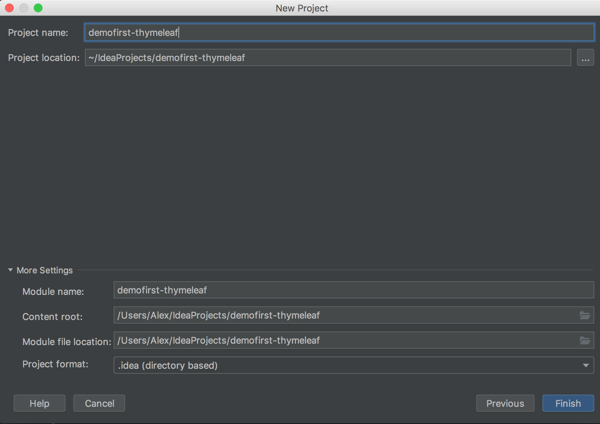
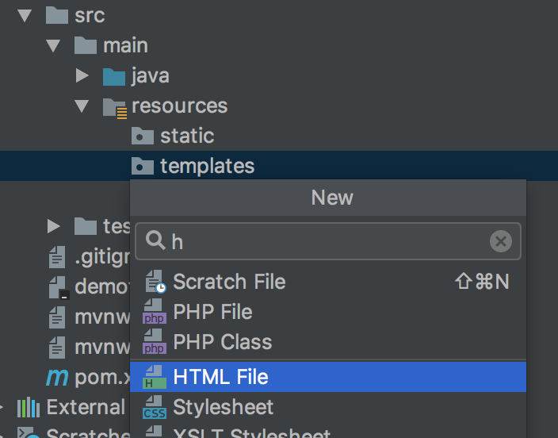
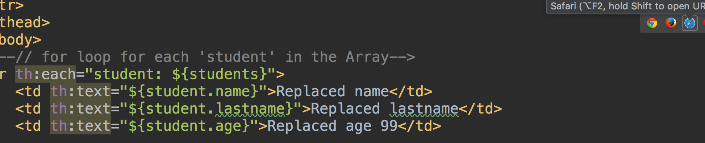
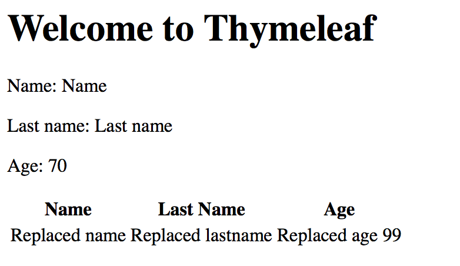

# Thymeleaf introduction

Introduction to Thymeleaf.  

## Getting Started

IntelliJ installed

### Prerequisites 
(see screenshots, if not cloning from Master repository)

### Installing

Create a new project with the following screenshots as a guide
<table>
    <tr>
        <td>
            
        </td>
        <td>
            
        </td>
        <td>
            
        </td>
<td></td>
    </tr>
<tr>
        <td>
            
        </td>
        
</table>

## Running the tests
 
Instead of constantly restarting the server, if there are minor changes you wish to see, click it in the browser icon
 
 
This way you can see what things are like before you then start the server.

## Built With

* [Tomcat plugin](https://mvnrepository.com/artifact/org.apache.tomcat/tomcat-jdbc) - Server plugin
* [Thymeleaf](https://www.baeldung.com/thymeleaf-in-spring-mvc) 
* [MySQL](https://www.mysql.com/) - MySQL database

## Authors

* **Ryan Alexander** - *Junior Java Developer* - [LinkedIn](https://www.linkedin.com/in/rememberryan/)

## Acknowledgments

* SDA